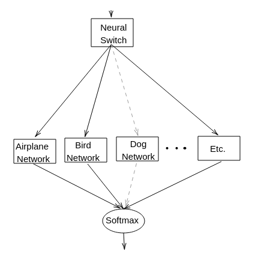

# Meta Neural Networks


The current generation of neural networks uses all neurons during inference, which is in stark contrast to how the human brain operates.
The brain only activates the regions of the brain that are relevant for interpreting the current input data, instead of activating all available parts of the brain. This contributes to the high efficiency of the brain. 
To increase efficiency in artificial neural networks, we implement a neural network that consists of multiple smaller neural networks (meta neural network), which more closely resembles the neural networks nature designed. 

[PDF report](report.pdf)


To build the docker image, run:
```
docker build docker -t meta_nn
```

You can then start the container with
```
docker run -it --mount src="$(pwd)",target=/mounted,type=bind --gpus all meta_nn
```
This mounts the current directory under `/mounted` in the docker container.


# Using docker
To enter the docker container, run `./start_docker_container.sh`.

To execute commands in the docker environment from your normal shell, you can use the `docker_run` command:
```
source utils.sh
docker_run "
pwd;
python3 ./cifar10_test.py --classifier mobilenet_v2 --data_dir /mounted/data
```


# Files 

`./test_gpu_classes_print_result.sh`: Print the accuracy of the specialized neural networks.


# Traning
```
# Train Neural Switch
./train_gpu.sh

# Generate probabilities for the training set
./gen_probabilities_gpu.sh

# Training specialized networks
./train_classes_from_scratch.sh

# Test the whole MNN architecture
./test_mnn_print_result.sh
```


# Analyzing the expert threshold
To get the accuracy values for different offsets, run:
```
./generate_switch_threshold_accuracy.sh
```
This will write the threshold and corresponding accuracy to `plotting/switch_threshold_accuracy`.

Plot the results (run outside docker):
```
python3 plot_csv.py plotting/switch_threshold_accuracy
```


Contains code from https://github.com/huyvnphan/PyTorch_CIFAR10.
